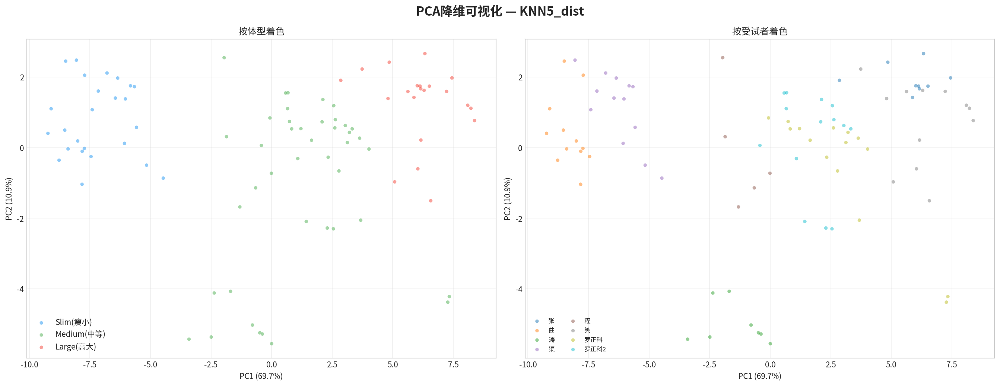

# 汽车座椅压力传感器体型三分类算法方案

**作者**: Manus AI
**日期**: 2026-02-25

## 1. 项目概述

本项目旨在基于汽车座椅的144点压力传感器数据，开发一套能够自动识别乘客体型（瘦小、中等、高大）的Python算法包。该算法包需要实现从原始CSV数据加载、特征工程、模型训练到分类预测的完整流程，并提供清晰的可视化分类结果。最终目标是将该算法包集成到Git仓库的`dev`分支，形成一套可复用、可迭代的算法解决方案。

## 2. 数据探索与特征工程

### 2.1 数据概况

我们使用了8位不同受试者的数据，这些数据以CSV文件的形式提供。经过入座状态筛选（去除入座和离座的过渡帧），我们共获得了1503个有效数据帧（时间样本）。

| 体型   | 受试者数量 | 关键受试者（体重） | 有效帧数 |
| :----- | :--------- | :----------------- | :------- |
| **瘦小** | 2          | 曲 (48kg), 渠 (45kg) | 416      |
| **中等** | 4          | 程 (60kg), 涛 (70kg), 罗正科 (未知), 罗正科2 (72kg) | 726      |
| **高大** | 2          | 笑 (90kg), 张 (92kg) | 361      |

### 2.2 增强特征工程

为了充分挖掘压力数据中的体型信息，我们设计了一套包含92个特征的增强特征集，远超原始脚本的规模。这些特征可以分为以下几类：

- **基础统计特征**: 均值、标准差、总和、最大值、百分位数、IQR等。
- **分布形态特征**: 偏度（Skewness）和峰度（Kurtosis），描述压力分布的对称性和尖锐程度。
- **能量特征**: 压力的二阶统计量（能量、均方根），对压力大小更敏感。
- **空间分布特征**: 包括行/列方向的压力分布、上/中/下三段的压力比例、左右对称性等。
- **压力中心 (CoP)**: 反映整体压力集中的位置。
- **分块区域特征**: 将10x6的矩阵划分为2x3的六个区域，分别统计各区域的压力特征，以捕捉局部差异。
- **梯度特征**: 压力在行/列方向的变化率，反映压力分布的平滑度。
- **组合特征**: 靠背与坐垫之间的交叉特征，如总压力、靠背/坐垫压力比等。

### 2.3 特征区分度分析

通过方差分析（ANOVA F-test），我们量化了每个特征对体型三分类的区分能力。关键发现如下：

- **坐垫特征的区分度普遍高于靠背特征**，说明坐垫更能反映体重和体型差异。
- **压力总量和能量相关特征区分度最高**。例如`total_energy` (总能量) 和 `cush_mean` (坐垫均值) 的 η² (Eta-squared，效应量) 分别达到了0.69和0.67，表明这些特征能够解释体型类别间近70%的方差。
- **分布形态特征（如峰度）和空间分布特征（如分块压力、压力中心位置）也表现出很强的区分能力**，证明了捕捉压力分布形态和空间信息的重要性。

## 3. 分类算法设计与评估

### 3.1 评估策略：留一受试者交叉验证 (LOSO-CV)

考虑到样本量有限（仅8位受试者），且个体间压力分布模式差异显著（如下图t-SNE所示，每个人的数据点都形成了独立的簇），我们采用了**留一受试者交叉验证 (Leave-One-Subject-Out Cross-Validation)** 的评估策略。该策略每次将一位受试者的全部数据作为测试集，用其余7位受试者的数据训练模型。重复8次后，将所有预测结果汇总进行评估。这种方法能最真实地模拟算法在**面对全新用户时的泛化能力**。


*图1：t-SNE降维可视化。左图按体型着色，右图按受试者着色。右图清晰地显示，数据首先按个体聚类，而非体型，这揭示了巨大的个体间差异，是本任务的主要挑战。*

### 3.2 改进策略：受试者级多帧投票

初步的“逐帧”分类评估显示，模型的准确率不理想（最佳模型F1-macro约为0.60）。主要原因是巨大的个体差异和帧间噪声。在实际应用中，系统可以采集用户入座后的一段时间（例如数秒）的数据，然后做出判断。基于此，我们设计了**受试者级多帧投票 (Majority Voting)** 机制：

> 对留出的测试受试者的所有数据帧进行预测，然后统计所有预测结果，将得票最多的类别作为该受试者的最终分类结果。

这一策略显著提升了分类的鲁棒性和准确性。

### 3.3 模型对比与选择

我们评估了包括逻辑回归、支持向量机（SVM）、K近邻（KNN）、随机森林在内的8种主流分类模型。基于**帧级F1分数**和**投票准确率**的综合评分，**逻辑回归 (Logistic Regression)** 被选为最佳模型。


*图2：不同模型在LOSO-CV下的帧级性能对比。逻辑回归和线性SVM在F1分数上表现最佳。*

## 4. 最终结果与分析

### 4.1 投票机制下的分类结果

采用多帧投票机制后，最佳模型（逻辑回归）在8位受试者中成功预测了5位，**受试者准确率达到62.5%**。这是一个相对可靠的结果，远高于随机猜测（33.3%）。


*图3：受试者级投票分类结果。左图展示了每位受试者的真实体型与投票预测结果的对比，绿色“✓”表示正确，红色“✗”表示错误。右图展示了投票的置信度（多数票占比）和该受试者的帧级分类准确率。*

### 4.2 结果分析

从上图的投票结果可以得出以下结论：

- **分类成功案例**：模型成功区分了两位瘦小、一位中等和两位高大的受试者。对于这些案例，投票置信度普遍较高（如“涛”达到93%），说明模型对他们的判断非常确定。
- **分类失败案例**：模型错误地将三位“中等”体型的受试者进行了分类。
    - **程 (60kg)** 被错分为“瘦小”。这与我们数据探索阶段的发现一致，其压力分布特征确实更接近瘦小体型，导致模型混淆。
    - **罗正科** 和 **罗正科2 (72kg)** 被错分为“高大”。这暴露了“中等”体型内部的巨大差异性，其压力模式可能与“高大”体型存在重叠。
- **“中等”体型的挑战**：所有分类错误都发生在“中等”体型上，这表明“中等”是一个边界模糊、内部差异大的类别。未来的改进方向应重点关注如何更好地区分“中等”体型与“瘦小”、“高大”体型的边界。

### 4.3 降维空间中的分类边界

下图展示了在PCA降维空间中，逻辑回归模型的分类结果。可以看出，虽然存在大量错误分类（红色叉号），但模型的决策边界在宏观上遵循了从“瘦小”（蓝色）到“中等”（绿色）再到“高大”（红色）的趋势。


*图4：PCA降维空间中的分类结果。左图为真实标签，中图为模型预测标签，右图高亮了分类错误的样本。*

## 5. 算法包结构与使用

我们构建了一个名为 `body_type_classifier` 的Python算法包，其结构如下：

```
car-beiqi/
├── body_type_classifier/      # 算法包核心代码
│   ├── __init__.py
│   ├── data_loader.py         # 数据加载与预处理
│   ├── feature_engineer.py    # 特征工程
│   ├── classifier.py          # 分类器（训练、评估、预测、投票）
│   └── visualizer.py          # 可视化工具
├── data/                      # 原始CSV数据
├── output/                    # 运行结果输出目录（图表、报告、模型文件）
├── run_classification.py      # 主运行脚本
└── ALGORITHM_SUMMARY.md       # 本文档
```

通过运行 `run_classification.py` 脚本，即可复现从数据加载、模型评估到结果保存的完整流程。最终训练好的模型被保存在 `output/body_type_model.pkl` 文件中，可用于后续的部署和推理。

## 6. 总结与未来工作

本方案成功构建了一套端到端的体型三分类算法包，并通过引入**留一受试者交叉验证**和**多帧投票机制**，为模型提供了更真实和鲁棒的性能评估。当前最佳模型（逻辑回归）在受试者级别的准确率达到了**62.5%**。

主要挑战在于“中等”体型的定义模糊和内部差异大。未来的改进方向包括：

1.  **扩充数据集**：引入更多，特别是“中等”体型的受试者数据，以帮助模型学习更清晰的分类边界。
2.  **优化特征**：针对“中等”体型，设计更能体现其与其他类别差异的特征。
3.  **模型融合**：尝试使用模型融合（Ensemble）技术，如将多个表现较好的模型进行投票，可能进一步提升稳定性。
4.  **考虑回归模型**：除了分类，也可以尝试直接预测体重等连续值，再根据体重范围划分体型，可能比直接三分类效果更好。
