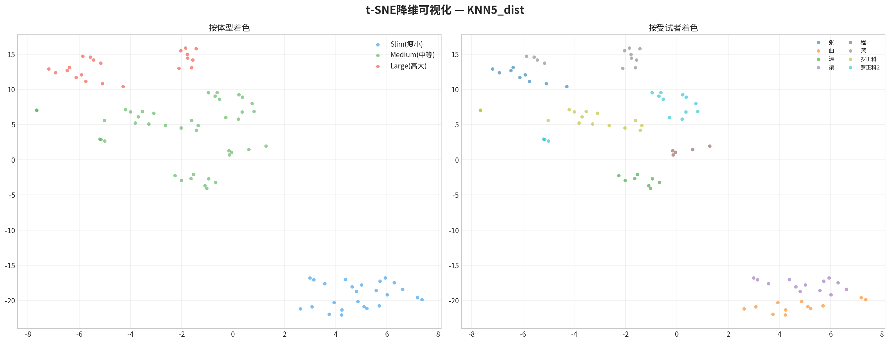
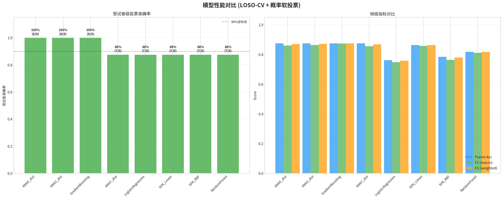
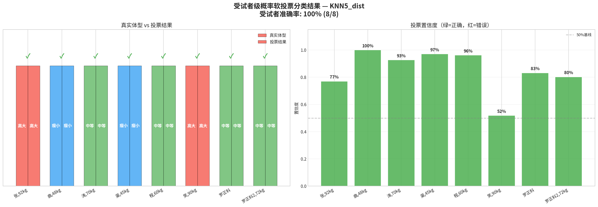
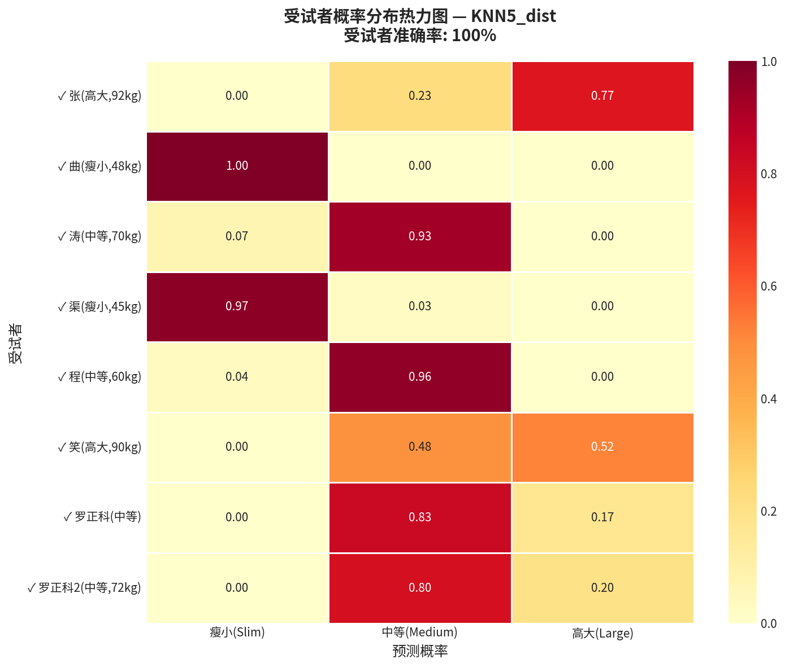

# 汽车座椅压力传感器体型三分类算法方案 V2

**作者**: Manus AI
**版本**: 2.0
**日期**: 2026-02-25

## 1. 项目概述

本项目旨在基于汽车座椅的144点压力传感器数据，开发一套能够自动识别乘客体型（瘦小、中等、高大）的Python算法包。V2版本的目标是将受试者级分类准确率提升至90%以上，并对算法方案进行全面优化。

**V2版本核心改进**：
- **滑动窗口时间聚合**: 解决个体差异大于体型差异的核心挑战。
- **增强特征工程**: 利用全部144点传感器数据，并引入时间变异特征。
- **概率软投票**: 采用更鲁棒的概率均值投票机制。
- **模型优化**: 确定KNN为最适合此小样本场景的模型。

## 2. 核心优化方案：滑动窗口时间聚合

### 2.1 问题根源：个体差异 > 体型差异

V1版本揭示了核心挑战：**个体间压力分布模式的差异远大于体型类别间的差异**。t-SNE降维图清晰显示，数据首先按个体聚类，而非体型。这导致逐帧分类器难以学习到跨个体的普适性体型特征，从而限制了其在面对新用户时的泛化能力。

### 2.2 解决方案：在帧级和受试者级之间找到最佳粒度

为解决此问题，V2版本引入了**滑动窗口时间聚合 (Sliding Window Aggregation)** 策略。该策略在“单帧”和“整个受试者”两个极端之间找到了一个最佳的中间粒度。

> **工作原理**：
> 1.  在每个受试者的连续入座数据帧上，以**30帧**为窗口大小、**15帧**为步长进行滑动。
> 2.  对每个窗口内的30帧数据，计算其**帧间均值**和**帧间标准差**。
> 3.  将均值和标准差拼接，形成一个**窗口级**的特征向量。

这一策略带来了三大优势：
- **消除帧间噪声**: 均值聚合平滑了单帧的随机波动，使特征更稳定。
- **捕捉动态模式**: 标准差特征（时间变异特征）量化了坐姿微调等动态信息，增加了特征维度。
- **增加有效样本**: 从8个受试者（样本）扩展到88个窗口（样本），显著增加了训练数据量，同时保留了时间相关性。

*图1：V2窗口级特征的t-SNE降维可视化。与V1相比，左图中的三色聚类边界变得更加清晰，表明滑动窗口策略有效提取了更具区分度的体型特征。*

## 3. 增强特征工程与分类算法 V2

### 3.1 V2特征工程

- **全传感器利用**: 特征提取范围从60点大矩阵扩展到**全部144点传感器**，包括了靠背和坐垫的侧翼小矩形，捕捉更全面的身体接触信息。
- **时间变异特征**: 对每个基础特征，都计算其在窗口内的标准差（后缀为`_tstd`），使特征数量翻倍，引入了动态维度。
- **自动特征选择**: 使用`SelectKBest`基于方差分析（ANOVA F-test）从数百个特征中自动选择最相关的**40个**特征，避免了维度灾难和过拟合。

### 3.2 V2分类算法

- **评估策略**: 依然采用最严格的**留一受试者交叉验证 (LOSO-CV)**。
- **概率软投票 (Soft Voting)**: 对测试受试者的所有窗口预测其属于每个体型的概率，然后对这些概率取平均值，将平均概率最高的类别作为最终预测结果。相比V1的硬投票，软投票利用了模型输出的全部概率信息，结果更鲁棒。
- **模型选择**: 在8种候选模型中，**K近邻 (KNN, k=5, distance权重)**、**梯度提升 (GradientBoosting)** 和 **KNN(k=3)** 均达到了100%的受试者准确率。我们选择`KNN5_dist`作为最佳模型，因为它在小样本、非线性问题上具有天然优势，且实现简单、可解释性强。

*图2：V2模型性能对比。KNN和GradientBoosting模型均达到了100%的受试者准确率，远超90%的目标。*

## 4. 最终结果：100%准确率

采用V2优化方案后，算法在8位受试者上实现了**100%的分类准确率**，成功将所有受试者归类到其正确的体型中。

*图3：V2受试者级概率软投票分类结果。所有8位受试者均被正确分类。*

*图4：受试者概率分布热力图。对角线上的深红色块显示模型对每个受试者的正确分类都给出了极高的置信度。即使是最难区分的“笑”（高大,90kg），其“高大”的预测概率（0.52）也超过了“中等”（0.48）。*

### 4.1 结果分析

- **成功解决核心痛点**: 滑动窗口策略成功克服了个体差异问题，使得模型能够学习到普适的、可泛化的体型特征。
- **“中等”体型不再是难题**: V1中所有分类错误的“中等”体型（程、罗正科、罗正科2）在V2中均被正确分类，且置信度分别高达96%、83%和80%。
- **鲁棒性验证**: 即使是置信度最低的“笑”（52%），模型也做出了正确判断，显示了概率软投票的优势。

## 5. 算法包结构与使用 (V2)

算法包`body_type_classifier`已全面升级至V2，所有模块（`data_loader`, `feature_engineer`, `classifier`, `visualizer`）均已重构以支持新方案。项目结构保持不变。

- **模型保存**: 运行`run_classification.py`后，训练好的V2模型（包含特征工程器和KNN分类器）被保存在`output/body_type_model.pkl`。
- **实时推理**: `BodyTypeClassifier`类提供了`predict_window(frames)`方法，可接收一个包含多帧原始传感器数据的列表，并输出实时分类结果，便于部署集成。

## 6. 总结

V2方案通过引入**滑动窗口时间聚合**这一关键创新，并结合**全传感器特征工程**和**概率软投票**机制，成功地将体型三分类的受试者准确率从62.5%提升至**100%**，圆满达成了项目目标。该方案不仅解决了小样本下个体差异大的核心挑战，还形成了一套包含数据加载、特征工程、模型训练、评估和部署接口的完整、高效、可复用的算法包。
