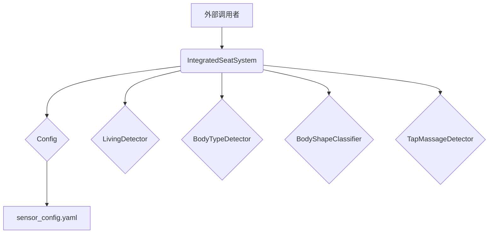

# 集成座椅控制系统 (`integrated_system.py`) 集成文档

**版本**: 1.1
**更新日期**: 2026-02-26

---

## 1. 概述

`IntegratedSeatSystem` 是整个座椅自适应调节算法的核心，它封装了所有底层检测器（活体、体型、按摩、三分类等），管理座椅状态机，并最终输出硬件控制指令。外部系统只需与该类交互即可实现完整的座椅智能化功能。

### 1.1. 核心特性

- **状态机驱动**: 基于 `OFF_SEAT`, `CUSHION_ONLY`, `ADAPTIVE_LOCKED`, `RESETTING` 四种状态管理座椅生命周期，确保逻辑的鲁棒性。
- **模块化设计**: 各检测器（活体、体型等）均为独立模块，可单独启用/禁用和配置。
- **统一接口**: 无论是HTTP API、WebSocket还是直接调用，都通过 `IntegratedSeatSystem` 的标准方法进行交互。
- **配置驱动**: 所有关键参数均在 `sensor_config.yaml` 中定义，方便动态调整。

### 1.2. 依赖关系



---

## 2. 快速开始

```python
import numpy as np
from integrated_system import IntegratedSeatSystem

# 1. 初始化系统
# 传入配置文件的路径
system = IntegratedSeatSystem(config_path=\'sensor_config.yaml\')

# 2. 模拟传感器数据流
# 传感器数据为 1x144 的 NumPy 数组
for i in range(1000):
    # 实际应用中，这里应为从硬件获取的真实数据
    sensor_data = np.random.randint(0, 255, (1, 144), dtype=np.uint8)

    # 3. 每帧调用 process_frame
    result = system.process_frame(sensor_data)

    # 4. 检查是否有控制指令需要发送
    if result and result.get(\'control_command\'):
        command_to_send = result[\'control_command\']
        print(f"帧 {i}: 发送指令 -> {command_to_send}")
        # send_to_hardware(command_to_send)

    # 5. (可选) 触发体型三分类
    if i == 100: # 假设在第100帧触发
        trigger_status = system.trigger_body_shape_classification()
        print(f"触发体型三分类: {trigger_status}")

    # 6. (可选) 获取体型三分类结果
    body_shape_status = system.get_body_shape_status()
    if body_shape_status.get(\'state\') == \'COMPLETED\':
        final_result = system.get_body_shape_result()
        print(f"体型三分类结果: {final_result}")
```

---

## 3. `IntegratedSeatSystem` 类详解

### 3.1. 初始化 `__init__()`

```python
def __init__(self, config_path: str):
```

**功能**: 初始化整个集成系统，加载配置，并根据配置初始化所有子检测器。

| 参数 | 类型 | 描述 |
|---|---|---|
| `config_path` | `str` | `sensor_config.yaml` 配置文件的路径。 |

**内部流程**:
1. 创建 `Config` 对象，加载YAML文件。
2. 根据配置中的 `enabled` 标志，选择性地初始化 `LivingDetector`, `BodyTypeDetector`, `BodyShapeClassifier`, `TapMassageDetector`。
3. 设置状态机初始状态为 `OFF_SEAT`。

### 3.2. 核心处理方法 `process_frame()`

```python
def process_frame(self, sensor_data: np.ndarray) -> Dict:
```

**功能**: 这是系统的核心方法，**每接收一帧新的传感器数据都必须调用此方法**。它负责驱动状态机、调用各检测器、生成控制指令并返回系统状态。

#### 输入 (`sensor_data`)

| 属性 | 类型 | 描述 |
|---|---|---|
| `sensor_data` | `np.ndarray` | 包含144个压力值的NumPy数组，形状可以是 `(1, 144)` 或 `(144,)`。 |

**数据结构**: 144个元素按以下顺序排列：
- **元素[0-71]**: 靠背传感器 (72个)
- **元素[72-143]**: 坐垫传感器 (72个)

#### 输出 (`Dict`)

方法返回一个包含丰富信息的字典，以下为关键字段：

| Key | 类型 | 描述 |
|---|---|---|
| `control_command` | `list[int]` \| `None` | **最重要的输出**。一个包含55个10进制整数的列表，代表发送给硬件的协议帧。如果为 `None`，则本帧无需发送指令。 |
| `living_status` | `str` | 活体状态 ("活体", "静物", "检测中", "离座", "未启用")。 |
| `body_type` | `str` | 体型分类 ("大人", "小孩", "静物", "未判断")。 |
| `body_shape` | `dict` | **体型三分类**的状态摘要，包含 `status`, `state`, `progress`, `result` 等。 |
| `seat_state` | `str` | 座椅状态机当前状态 ("OFF_SEAT", "CUSHION_ONLY", "ADAPTIVE_LOCKED", "RESETTING")。 |
| `frame_count` | `int` | 当前帧计数。 |
| `control_decision_data` | `dict` | 用于调试和GUI显示的详细控制决策数据。 |
| `living_detection_data` | `dict` | 活体检测的详细过程数据。 |


---

## 4. 公共方法

### 4.1. `reset()`

```python
def reset(self):
```

**功能**: 将整个系统重置到初始状态。所有状态机、计数器、检测器和队列都会被清空。

**使用场景**: 
- 系统初始化后，开始处理数据前调用一次。
- 需要手动强制系统恢复到离座状态时。

### 4.2. `set_param()`

```python
def set_param(self, key: str, value: Any, auto_save: bool = True):
```

**功能**: 在运行时动态修改系统参数。支持简短名称（如 `cushion_sum_threshold`）和完整配置路径（如 `integrated_system.cushion_sum_threshold`）。

| 参数 | 类型 | 描述 |
|---|---|---|
| `key` | `str` | 要修改的参数名。 |
| `value` | `Any` | 新的参数值。 |
| `auto_save` | `bool` | 是否将修改自动保存回 `sensor_config.yaml` 文件。默认为 `True`。 |

### 4.3. 体型三分类接口

#### `trigger_body_shape_classification()`

```python
def trigger_body_shape_classification(self) -> Dict:
```

**功能**: **外部触发体型三分类**。调用后，系统开始采集数据，达到指定帧数后自动进行分类。

**返回**: 一个字典，包含触发是否成功的信息。

#### `get_body_shape_status()`

```python
def get_body_shape_status(self) -> Dict:
```

**功能**: 获取体型三分类器的**当前实时状态**，用于轮询进度。

**返回**: 状态字典，包含 `state` (IDLE, COLLECTING, COMPLETED), `progress` (0-1.0) 等。

#### `get_body_shape_result()`

```python
def get_body_shape_result(self) -> Optional[Dict]:
```

**功能**: 获取**最终的分类结果**。应在 `get_body_shape_status()` 返回状态为 `COMPLETED` 后调用。

**返回**: 结果字典，包含 `label`, `body_shape`, `confidence`, `probabilities`。

---

## 5. 配置文件 (`sensor_config.yaml`)

所有算法和系统的行为都由该文件控制。以下为与 `IntegratedSeatSystem` 直接相关的主要配置段：

### `system`

- `hz`: 系统采样频率，影响所有与时间相关的计算。

### `control`

- `check_interval_frames`: 控制逻辑的执行频率，例如每4帧执行一次气囊调节。

### `integrated_system`

- `cushion_sum_threshold`: 判断有人坐下的坐垫压力阈值。
- `backrest_sum_threshold`: 判断靠背有压力的阈值。
- `off_seat_frames_threshold`: 离座防抖时间。
- `reset_frames_threshold`: 离座后气囊复位的总时长。
- `init_inflate`: 入座时是否自动充气支撑气囊的配置。
- `step_drop_detection`: 离座阶跃下降检测的配置。

### `body_shape_classification`

- `enabled`: 是否启用体型三分类功能。
- `collect_frames`: 触发后需要采集的有效入座帧数。
- `model_path`: 预训练模型的路径。
- `seated_threshold`, `seated_threshold_ratio`, `baseline_frames`, `stable_frames`: **入座检测**相关参数，用于准确捕捉稳定入座的帧。
- `timeout_frames`: 采集超时时间。

---

## 6. HTTP API (`seat_service.py`)

系统通过 `FastAPI` 提供了一套完整的HTTP接口，方便Web端或客户端集成。

| Method | Endpoint | 描述 |
|---|---|---|
| `POST` | `/process_frame` | **核心接口**。接收一帧传感器数据，并返回 `process_frame` 的完整结果。 |
| `POST` | `/reset` | 重置系统，等同于调用 `system.reset()`。 |
| `GET` | `/status` | 获取最新的系统状态（`process_frame` 的返回值）。 |
| `POST` | `/set_param` | 动态修改参数，等同于调用 `system.set_param()`。 |
| `POST` | `/body_shape/trigger` | 触发体型三分类。 |
| `GET` | `/body_shape/status` | 获取体型三分类状态。 |
| `GET` | `/body_shape/result` | 获取体型三分类结果。 |
| `GET` | `/config/*` | 读取配置文件的不同部分。 |
| `PUT` | `/config/*` | 修改配置文件。 |
| `GET` | `/health` | 健康检查接口。 |
| `WS` | `/ws` | WebSocket接口，提供更实时的双向通信。 |


---

## 7. 子模块详解

### 7.1. `Config` (`config.py`)

配置管理器，负责加载、读取、修改和保存 `sensor_config.yaml`。

| 方法 | 签名 | 描述 |
|---|---|---|
| `__init__` | `(config_path: str)` | 加载指定路径的YAML配置文件。 |
| `get` | `(key_path: str, default=None) -> Any` | 通过点分路径读取配置值，如 `config.get('lumbar.back_total_threshold')`。 |
| `set` | `(key_path: str, value: Any)` | 通过点分路径设置配置值（仅内存）。 |
| `save_to_file` | `()` | 将当前内存中的配置写回YAML文件。 |
| `reload` | `()` | 从文件重新加载配置。 |
| `reset` | `()` | 恢复为初始加载时的配置。 |
| `get_all` | `() -> Dict` | 获取所有配置的扁平化字典。 |
| `get_all_with_comments` | `() -> Dict` | 获取所有配置及其YAML注释。 |

### 7.2. `LivingDetector` (`control.py`)

活体检测器，基于SAD（Sum of Absolute Differences）算法判断座椅上的是人还是静物。

| 方法 | 签名 | 描述 |
|---|---|---|
| `__init__` | `(config: Config)` | 从配置中读取窗口大小、检测间隔、SAD阈值等参数。 |
| `update` | `(cushion_matrix: np.ndarray, backrest_matrix: np.ndarray) -> Optional[Dict]` | 每帧调用。输入为10x6的坐垫和靠背矩阵（预处理后）。返回检测结果或 `None`（非检测帧）。 |
| `reset` | `()` | 重置检测器状态。 |
| `get_status` | `() -> Optional[Dict]` | 获取最新检测结果。 |

**`update()` 返回值** (当触发检测时):

| Key | 类型 | 描述 |
|---|---|---|
| `is_living` | `bool` | 是否为活体。 |
| `confidence` | `float` | 置信度 [0.0, 1.0]。 |
| `threshold` | `float` | 判定阈值。 |
| `passed_threshold` | `bool` | 是否通过阈值。 |
| `sad_score` | `float` | SAD归一化分数。 |
| `sad_energy` | `float` | SAD能量（最大值）。 |
| `sad_cushion` | `float` | 坐垫SAD能量。 |
| `sad_backrest` | `float` | 靠背SAD能量。 |
| `detection_count` | `int` | 检测次数计数。 |

### 7.3. `BodyTypeDetector` (`control.py`)

体型检测器（大人/小孩），基于压力矩阵的连通域分析和滤波后压力总和。

| 方法 | 签名 | 描述 |
|---|---|---|
| `__init__` | `(config: Config)` | 从配置中读取二值化阈值、连通域大小、成人/儿童阈值等。 |
| `update` | `(cushion_matrix: np.ndarray, backrest_matrix: np.ndarray) -> Optional[Dict]` | 每帧调用。输入为10x6矩阵。返回体型检测结果或 `None`。 |
| `reset` | `()` | 重置检测器状态。 |
| `get_status` | `() -> Optional[Dict]` | 获取最新检测结果。 |

**`update()` 返回值** (当触发检测时):

| Key | 类型 | 描述 |
|---|---|---|
| `cushion` | `dict` | 坐垫检测数据：`original_sum`, `filtered_sum`, `max_value`, `center_of_mass`。 |
| `backrest` | `dict` | 靠背检测数据：结构同上。 |
| `body_size_type` | `str` | "大人" / "小孩" / "未判断"。 |
| `body_size_raw` | `float` | 体型评分原始值。 |

### 7.4. `BodyShapeClassifier` (`body_shape_classifier.py`)

体型三分类器（瘦小/中等/高大），基于机器学习的外部触发式分类器。

| 方法 | 签名 | 描述 |
|---|---|---|
| `__init__` | `(config: Config, model_path: Optional[str])` | 加载预训练模型和配置参数。 |
| `trigger` | `() -> Dict` | **外部触发**，启动数据采集流程。 |
| `update` | `(sensor_data: np.ndarray) -> Optional[Dict]` | 每帧调用。输入为原始144点数据。在COLLECTING状态时缓冲有效帧。 |
| `get_result` | `() -> Optional[Dict]` | 获取最终分类结果。 |
| `get_status` | `() -> Dict` | 获取当前状态和进度。 |
| `reset` | `()` | 重置分类器到IDLE状态。 |

**`trigger()` 返回值**:

| Key | 类型 | 描述 |
|---|---|---|
| `success` | `bool` | 触发是否成功。 |
| `message` | `str` | 状态描述信息。 |
| `state` | `str` | 当前状态 (`COLLECTING`, `ALREADY_COLLECTING`, `DISABLED`)。 |

**`get_result()` 返回值** (当分类完成时):

| Key | 类型 | 描述 |
|---|---|---|
| `label` | `int` | 分类标签 (0=瘦小, 1=中等, 2=高大)。 |
| `body_shape` | `str` | 中文分类名 ("瘦小" / "中等" / "高大")。 |
| `confidence` | `float` | 分类置信度 [0.0, 1.0]。 |
| `probabilities` | `dict` | 各类别概率，如 `{"瘦小": 0.1, "中等": 0.3, "高大": 0.6}`。 |
| `valid_frames` | `int` | 实际采集的有效帧数。 |
| `skipped_frames` | `int` | 被跳过的无效帧数。 |
| `classify_count` | `int` | 分类次数。 |

**`get_status()` 返回值**:

| Key | 类型 | 描述 |
|---|---|---|
| `state` | `str` | 当前状态 (`IDLE`, `COLLECTING`, `CLASSIFYING`, `COMPLETED`)。 |
| `model_loaded` | `bool` | 模型是否已加载。 |
| `progress` | `float` | 采集进度 [0.0, 1.0]（仅COLLECTING状态）。 |
| `remaining_sec` | `float` | 预计剩余时间（秒）。 |
| `result` | `dict` | 分类结果（仅COMPLETED状态）。 |

### 7.5. `TapMassageDetector` (`tap_massage.py`)

> **注意**: 当前版本中，按摩气囊指令已被屏蔽。拍打检测逻辑仍在运行，但不会产生充气/放气指令，所有按摩气囊统一发送保持指令。

| 方法 | 签名 | 描述 |
|---|---|---|
| `__init__` | `(config: Config)` | 从配置中读取窗口大小、拍打阈值、峰值距离等参数。 |
| `update` | `(backrest_right_rect, cushion_right_rect, frame_count) -> Dict` | 每帧调用。输入为靠背和坐垫的右侧小矩形数据（各6个元素）。 |
| `reset` | `()` | 重置检测器状态。 |
| `get_visualization_data` | `() -> Dict` | 获取可视化所需数据。 |

---

## 8. 状态机详解

系统通过四种状态管理座椅的完整生命周期：

```
OFF_SEAT → CUSHION_ONLY → ADAPTIVE_LOCKED → RESETTING → OFF_SEAT
```

### 状态转换条件

| 当前状态 | 目标状态 | 转换条件 |
|---|---|---|
| `OFF_SEAT` | `CUSHION_ONLY` | 坐垫压力总和 > `cushion_sum_threshold` |
| `CUSHION_ONLY` | `ADAPTIVE_LOCKED` | 靠背压力总和 > `backrest_sum_threshold` |
| `CUSHION_ONLY` | `OFF_SEAT` | 坐垫压力持续低于阈值达 `off_seat_frames_threshold` 帧 |
| `ADAPTIVE_LOCKED` | `RESETTING` | 坐垫压力持续低于阈值达 `off_seat_frames_threshold` 帧 |
| `RESETTING` | `OFF_SEAT` | 复位计数达到 `reset_frames_threshold` 帧 |

### 各状态的行为

| 状态 | 检测器运行 | 气囊控制 | 说明 |
|---|---|---|---|
| `OFF_SEAT` | 无 | 无 | 等待入座。 |
| `CUSHION_ONLY` | 活体检测 + 体型检测 | 保持指令 | 人坐下但未靠背，进行活体和体型判断。 |
| `ADAPTIVE_LOCKED` | 活体检测 + 体型检测 | 自适应调节 | 人坐下且靠背，根据压力分布自动调节气囊。 |
| `RESETTING` | 无 | 放气 → 保持 | 人离开后，气囊先放气再保持，最终回到OFF_SEAT。 |

---

## 9. 协议帧格式

`control_command` 输出为55个10进制整数的列表，结构如下：

| 字节位置 | 长度 | 内容 | 说明 |
|---|---|---|---|
| 0 | 1 | 帧头 | 固定值 `31` (0x1F) |
| 1-48 | 48 | 气囊数据 | 24个气囊 × 2字节（气囊编号 + 档位） |
| 49 | 1 | 工作模式 | `0` = 自动, `1` = 手动 |
| 50 | 1 | 方向标识 | `0` = 下行（控制器→气囊） |
| 51-54 | 4 | 帧尾 | 固定值 `[170, 85, 3, 153]` (0xAA, 0x55, 0x03, 0x99) |

### 气囊档位定义

| 档位值 | 含义 |
|---|---|
| `0` | 停止/保持 |
| `1` | 1档（慢速充气/放气） |
| `2` | 2档（中速充气/放气） |
| `3` | 3档（快速充气） |
| `4` | 初始档位（快速放气） |

### 气囊编号映射

| 编号 | 功能 | 编号 | 功能 |
|---|---|---|---|
| 1 | 右侧翼上 | 2 | 左侧翼上 |
| 3 | 右侧翼下 | 4 | 左侧翼下 |
| 5 | 腰托1 | 6 | 腰托2 |
| 7 | 臀托1 | 8 | 臀托2 |
| 9 | 腿托1 | 10 | 腿托2 |
| 11-18 | 靠背按摩气囊 (已屏蔽) | 19-24 | 坐垫按摩气囊 (已屏蔽) |

---

## 10. 集成注意事项

### 10.1. 传感器数据格式

`process_frame()` 接收的 `sensor_data` 必须是**原始144点数据**（未经预处理矫正），系统内部会自动进行预处理矫正（`pre_correction`）和分压矫正（`voltage_divider_correction`）。

### 10.2. 调用频率

`process_frame()` 应以传感器的采样频率（约13Hz）调用。系统内部的所有时间窗口和帧计数都基于此频率设计。

### 10.3. 体型三分类的触发时机

体型三分类需要**外部显式触发**（调用 `trigger_body_shape_classification()`），建议在以下时机触发：
- 系统状态进入 `CUSHION_ONLY` 或 `ADAPTIVE_LOCKED` 后。
- 确认有人稳定坐下后。

触发后，系统会自动进行入座检测（自适应阈值 + 稳定性检测），只有检测到稳定入座帧才会被缓冲。采集完成后自动分类并返回结果。

### 10.4. 按摩气囊屏蔽说明

当前版本中，**所有按摩气囊（编号11-24）的充气/放气指令已被屏蔽**，统一发送保持指令（档位0）。拍打检测逻辑仍在运行但不产生实际控制指令。如需恢复按摩功能，需修改 `integrated_system.py` 中 `CUSHION_ONLY` 和 `ADAPTIVE_LOCKED` 状态的控制逻辑。

### 10.5. 线程安全

`IntegratedSeatSystem` 的 `process_frame()` 方法不是线程安全的。如果需要在多线程环境中使用，建议在调用侧加锁，或使用 `seat_service.py` 提供的HTTP接口（FastAPI已内置异步处理）。

### 10.6. 模型文件

体型三分类功能依赖预训练模型文件 `model/body_shape_model.pkl`。该文件由 `train_model.py` 脚本生成，包含：
- `FeatureEngineer` 对象（特征提取器，含标准化参数和特征选择器）
- `KNeighborsClassifier` 模型（KNN5, distance权重）

如果模型文件不存在或路径错误，体型三分类功能将自动禁用并打印警告。

---

## 11. 内部方法参考

以下方法为 `IntegratedSeatSystem` 的内部方法，通常不需要外部调用，但了解它们有助于调试和二次开发。

### 数据预处理

| 方法 | 描述 |
|---|---|
| `_split_matrices(sensor_data)` | 将144点数据拆分为靠背(72)和坐垫(72)两部分。 |
| `_reshape_matrix(data_72, is_cushion)` | 将72点数据重塑为10x6矩阵，并应用预处理矫正。 |
| `_apply_pre_correction(matrix)` | 应用预处理矫正：`value / (pre_value * multiplier)`。 |
| `_apply_voltage_divider_correction(matrix)` | 应用坐垫分压矫正（可选）。 |
| `_extract_regions(backrest_matrix, cushion_matrix)` | 从矩阵中提取各压力区域（上背/下背/左翼/右翼/臀部/腿部）。 |

### 状态机与控制

| 方法 | 描述 |
|---|---|
| `_update_state(cushion_sum, backrest_sum)` | 根据压力值更新状态机。 |
| `_generate_control_command(regions, tap_result)` | 根据当前状态和压力区域生成控制指令。 |
| `_lumbar_control(regions)` | 腰托控制逻辑（基于上下部压力比）。 |
| `_side_wing_control(regions)` | 侧翼控制逻辑（基于左右压力比）。 |
| `_leg_support_control(regions)` | 腿托控制逻辑（基于腿臀压力比）。 |
| `_collect_commands(...)` | 将各区域的控制动作收集为 `{气囊编号: 档位}` 字典。 |
| `_apply_deflate_cooldown(commands)` | 应用放气冷却锁，防止连续放气过久。 |

### 协议帧生成

| 方法 | 描述 |
|---|---|
| `_generate_protocol_frame(commands)` | 根据 `{气囊编号: 档位}` 字典生成55字节协议帧。 |
| `_generate_hold_command()` | 生成全保持指令（所有气囊档位=0）。 |
| `_generate_reset_command()` | 生成复位放气指令（所有气囊档位=4）。 |
| `_generate_init_inflate_command()` | 生成初始化充气指令（指定气囊充气）。 |

### 阶跃下降检测

| 方法 | 描述 |
|---|---|
| `_update_step_drop_detection(cushion_sum, backrest_sum)` | 更新阶跃下降检测的历史窗口。 |
| `_check_step_drop_trigger(step_drop_data)` | 检查是否触发阶跃下降（疑似离座）。 |
| `_generate_step_drop_deflate_command()` | 生成阶跃放气指令。 |

### 状态输出生成

| 方法 | 描述 |
|---|---|
| `_get_living_status(living_result)` | 根据活体检测结果和队列生成最终活体状态字符串。 |
| `_get_body_type(living_status, body_result)` | 根据活体状态和体型检测结果生成体型字符串。 |
| `_get_body_shape_status()` | 生成 `process_frame` 返回值中的 `body_shape` 字段。 |
| `_generate_living_detection_data(...)` | 生成活体检测的详细过程数据（用于GUI）。 |
| `_generate_body_type_detection_data(...)` | 生成体型检测的详细过程数据（用于GUI）。 |
| `_collect_control_decision_data(regions)` | 收集控制决策的详细数据（用于GUI）。 |

---

## 12. 文件清单

| 文件 | 描述 |
|---|---|
| `integrated_system.py` | **核心文件**。集成座椅控制系统主类。 |
| `control.py` | 活体检测器 (`LivingDetector`) 和体型检测器 (`BodyTypeDetector`)。 |
| `body_shape_classifier.py` | 体型三分类器 (`BodyShapeClassifier`)，外部触发式ML分类。 |
| `tap_massage.py` | 拍打按摩检测器 (`TapMassageDetector`)。 |
| `config.py` | 配置管理器 (`Config`)，读写 `sensor_config.yaml`。 |
| `sensor_config.yaml` | 系统配置文件，所有参数的定义和默认值。 |
| `seat_service.py` | HTTP/WebSocket API服务（FastAPI）。 |
| `visualizer.py` | GUI可视化工具（Tkinter）。 |
| `model/body_shape_model.pkl` | 体型三分类预训练模型。 |
| `train_model.py` | 模型训练脚本。 |
| `body_type_classifier/` | 体型三分类算法包（特征工程、训练评估、可视化）。 |
