# 汽车座椅品味记忆功能深度解析

**版本**: 1.1
**作者**: Manus AI
**日期**: 2026-03-05

---

本文档详细解析“体型品味记忆”功能的算法思路、核心实现、接口变更及系统集成方式。

## 1. 概述

品味记忆功能的核心目标是**将用户主观的“舒适”感受量化为客观的控制参数**。系统默认的自适应调节逻辑是基于通用模型，不一定符合每个用户的个性化需求。当用户手动将座椅调节到最舒适的状态后，该功能允许系统“学习”并“记住”这个状态，后续当识别到同一用户（或体型）时，能自动维持在这个用户专属的舒适区间内，从而实现千人千面的自适应调节。

**V1.1 新增：鲁棒品味记录**

为了解决用户在记录品味时可能发生身体移动，导致采集到异常压力比例值的问题，V1.1引入了鲁棒品味记录机制。该机制利用用户在调节气囊时的**充放气次数**，构建一个合理的**置信区间**，对采集过程中的每一帧数据进行过滤，剔除或抑制异常值，从而获得更稳定、更可信的品味中心点。

## 2. 核心算法思路

算法的基石是将动态的、连续的调节问题，转化为一个**“保持区间” (Keep Interval) 的定义与应用**问题。

1.  **记录舒适状态**: 当用户调节完毕并触发“品味记录”时，我们并不记录气囊的绝对压力值或充放气指令。而是记录此刻座椅各个关键区域的**压力比例**。例如，腰托区域的“上部/下部压力比”、侧翼的“左/右压力比”等。这些比例能更稳定地反映用户的身形和坐姿习惯，相比绝对压力值，它对传感器漂移和温度变化的鲁棒性更强。

2.  **多帧平均降噪**: 为了避免单帧数据的偶然性（如用户微小移动），系统会连续采集30帧（约2.3秒）的压力数据，然后计算这些帧的**平均压力比例**。这等同于对用户的“舒适状态”进行了一次短时滑动窗口滤波，得到了一个更稳定、更可信的中心点。

3.  **生成保持区间**: 以计算出的平均比例为中心点 `C`，结合一个在配置文件中定义的 `margin` 值 `M`，系统生成一个动态的调节“保持区间” `[C - M, C + M]`。

4.  **区间应用**: 在后续的自适应调节中，系统会实时计算当前的压力比例 `R`：
    *   如果 `R` 落在 `[C - M, C + M]` 区间内，系统判定当前状态符合用户的“品味”，**不执行任何充放气操作 (HOLD)**。
    *   如果 `R` 超出该区间，系统则执行相应的充气或放气动作，使其回归到这个舒适区间内。

这个思路将复杂的连续控制问题，巧妙地简化为一个**基于阈值的离散决策问题**（充气/放气/保持），同时通过用户反馈动态调整了决策的阈值，实现了个性化自适应。

## 3. 鲁棒品味记录算法 (V1.1)

### 3.1. 核心思想

核心思想是利用用户调节行为的先验信息，约束采集数据的合理范围。

1.  **调节前状态**: 用户开始调节前，系统已处于自适应稳定状态，各区域比例值落在当前的**保持区间**内。
2.  **调节行为量化**: 用户的手动充/放气操作，会使压力比例从保持区间向特定方向偏移。例如，腰托充气会使腰部更凸出，导致靠背上部压力增大，`upper/lower` 比例升高。
3.  **构建置信区间**: 基于“调节前状态”和“调节行为”，我们可以预测出一个**合理的比例值范围**，即置信区间。采集到的数据如果落在这个区间外，则有理由认为是异常值（用户乱动）。

### 3.2. 置信区间计算

置信区间的计算分为三步：

1.  **计算基线中心**: 获取当前生效的保持区间（品味或默认），取其中点作为基线中心 `C_base`。
2.  **计算预期比例**: 根据传入的充放气次数，用**乘法因子模型**计算预期比例 `C_expected`。
    ```
    net_count = inflate_count - deflate_count
    C_expected = C_base * (1 + step_factor) ^ (net_count * direction)
    ```
    - `step_factor`: 每次充/放气操作对比例的平均影响因子（可配置）。
    - `direction`: 充气对该比例是正向还是负向影响（例如腰托充气使 `upper/lower` 比例升高，`direction=1`；腿托充气使 `f3/r3` 比例降低，`direction=-1`）。

3.  **构建置信区间**: 以预期比例为中心，乘以容差因子，构建最终的置信区间。
    ```
    lower_bound = C_expected * (1 - tolerance)
    upper_bound = C_expected * (1 + tolerance)
    ```
    - `tolerance`: 置信区间的半宽容差（可配置）。

### 3.3. 异常帧过滤

在30帧采集中，对每一帧计算出的比例 `R_observed`，系统会进行过滤：

- **截断模式 (Clamp)**: 如果 `R_observed` 超出置信区间，则强行修正为区间的上/下限。这是默认模式，表现稳健。
- **卡尔曼融合模式 (Kalman)**: 将预期比例作为预测值，观测比例作为观测值，进行卡尔曼滤波。观测值偏离越远，其权重越低。该模式在偶发异常时表现好，但连续异常时可能漂移。

经过滤后的30帧数据再取平均，得到最终的品味中心点。

## 4. 数据流与状态机

整个功能的数据流和状态转换如下：

```mermaid
graph TD
    subgraph 前置条件
        A["1. 体型三分类完成"] --> B{"获得体型: 中等"}
    end

    subgraph "品味记录流程 (V1.1)"
        C["2. 用户手动调节座椅"] --> D{"3. 上层软件触发 trigger_preference_recording(airbag_ops={...})"}
        D --> E["PreferenceManager.start_recording()"]
        E --> F{"状态: is_recording=true, 目标: 中等"}
        F --> G["构建置信区间"]
        G --> H["4. process_frame 中持续调用 feed_frame(regions)"]
        H --> I["采集30帧, **每帧进行置信区间过滤**"]
        I --> J["_finalize_recording: 计算平均比例, 生成品味区间"]
        J --> K["_save_to_file: 保存到 preferences.json"]
    end

    subgraph 品味应用流程
        L["5. 用户再次入座"] --> M["体型三分类识别, 结果: 中等"]
        M --> N["set_active_body_shape 中等"]
        N --> O["6. 气囊调节逻辑 lumbar/side_wing/leg"]
        O --> P["get_active_thresholds()"]
        P --> Q{"返回品味区间, is_preference=true"}
        Q --> R["7. 使用品味区间进行充/放/保决策"]
    end
```



## 5. 核心实现 (`PreferenceManager` 详解)

`preference_manager.py` 是该功能的独立核心模块，不依赖系统其他部分，具有高内聚性。

### 5.1. 关键方法 (V1.1 变更)

| 方法 | 职责 |
|---|---|
| `__init__(config, file)` | 初始化，加载配置（margin、**鲁棒记录参数**），并从 `preferences.json` 加载已保存的品味数据。 |
| `start_recording(shape, airbag_ops)` | **启动入口**。新增 `airbag_ops` 参数。检查前置条件，**构建置信区间**，设置记录状态。 |
| `feed_frame(regions)` | **数据采集**。在系统主循环中被调用，**对单帧比例进行置信区间过滤**，然后收集。当帧数达到预设值时，触发 `_finalize_recording`。 |
| `_compute_ratios(regions)` | **比例计算**。计算单帧数据中腰托、侧翼、腿托的压力比例。此处的计算逻辑与气囊控制逻辑中的比例计算**完全一致**，确保了“记录”和“应用”的对称性。 |
| `_finalize_recording()` | **核心算法**。对**过滤后**的采集数据求平均比例，然后调用 `_generate_thresholds` 生成区间，最后保存到文件。 |
| `_generate_thresholds(ratios)` | **区间生成**。根据平均比例和配置的 `margin`，计算出每个调节区域的 `inflate` 和 `deflate` 阈值。这是算法的核心数学实现。 |
| `get_active_thresholds()` | **区间提供者**。根据当前激活的体型，判断是返回该体型的品味区间，还是返回系统默认的调节区间。这是与系统解耦的关键。 |
| `_save_to_file()` / `_load_from_file()` | **持久化**。负责将内存中的品味数据以JSON格式写入文件，或在启动时从文件加载。 |

## 6. Python包调用接口 (V1.1 变更)

品味系统通过 `IntegratedSeatSystem` 类暴露了4个核心公共方法，供其他Python模块调用。

### 6.1. `trigger_preference_recording(body_shape: str = None, airbag_ops: Dict = None) -> Dict`

- **功能**: 启动一次新的品味记录流程。**支持鲁棒记录**。
- **调用时机**: 用户手动调节完座椅气囊，并感觉舒适稳定后调用。
- **参数**:
  - `body_shape` (str, 可选): 指定为哪个体型记录。如果留空，则使用当前已识别并激活的体型。
  - `airbag_ops` (Dict, 可选): **充放气次数字典**。传入此参数将激活鲁棒记录模式。格式如下：
    ```python
    {
        'lumbar': {'inflate': 3, 'deflate': 0},
        'side_wings_left': {'inflate': 1, 'deflate': 0},
        'leg_left': {'inflate': 0, 'deflate': 2},
        # ... 其他区域
    }
    ```
- **成功返回**:
  ```python
  {
    'success': True,
    'message': '开始记录品味...',
    'state': 'RECORDING',
    'target_shape': '中等',
    'total_frames': 30,
    'filter_mode': 'clamp',  // 过滤模式
    'confidence_intervals': { ... } // 各区域置信区间
  }
  ```

### 6.2. `cancel_preference_recording() -> Dict`

- **功能**: 中断正在进行中的品味记录。
- **调用时机**: 用户在记录过程中移动身体，或不希望继续记录时。

### 6.3. `get_preference_status() -> Dict`

- **功能**: 获取品味系统的完整实时状态。
- **调用时机**: 任何时候需要查询品味状态时。

### 6.4. `clear_preference(body_shape: str = None) -> Dict`

- **功能**: 删除已保存的品味数据。
- **调用时机**: 用户希望重置个性化设置时。

## 7. 配置文件 (`sensor_config.yaml`)

在 `sensor_config.yaml` 中新增了鲁棒品味记录相关的配置。

```yaml
preference:
  enabled: true
  record_frames: 30
  storage_path: preference_data.json

  # 品味区间的margin（各区域独立配置）
  lumbar_margin: 0.3
  side_wing_margin: 0.2
  leg_support_margin: 0.2

  # === 鲁棒品味记录配置 (V1.1) ===
  # 过滤模式: 'clamp'=截断(默认), 'kalman'=卡尔曼融合
  robust_filter_mode: clamp
  # 每次充/放气操作对比例值的乘法因子
  step_factor: 0.05
  # 置信区间容差（乘法容差）
  confidence_tolerance: 0.3
  # 卡尔曼融合参数
  kalman_process_variance: 0.01
  kalman_base_measure_variance: 0.02
  kalman_outlier_scale: 5.0
```

## 8. 总结与可复用思想

品味记忆功能的设计体现了几个重要的可复用思想：

1.  **用户反馈闭环 (User Feedback Loop)**: 它是典型的将用户隐式或显式反馈（此处为“手动调节后的舒适状态”）纳入算法迭代的闭环系统。算法不再是一个静态的模型，而是可以根据用户行为进行自适应演进。

2.  **关注相对量而非绝对量**: 算法的核心是“压力比例”，这是一个相对量。在很多传感器相关的算法中，使用相对量或变化率，通常比使用绝对量能更好地抵抗环境噪声、传感器漂移等干扰，从而获得更鲁棒的系统。

3.  **默认逻辑与策略覆盖 (Default Logic & Strategy Override)**: 系统提供了一套可靠的默认调节逻辑，同时设计了清晰的接口（`get_active_thresholds`）来允许一个独立的“策略模块”（`PreferenceManager`）在特定条件下（用户有品味数据时）覆盖这个默认逻辑。这大大提高了系统的可扩展性，未来可以方便地增加更多策略（如“运动模式”、“放松模式”等），而无需修改核心控制代码。

4.  **状态与逻辑分离**: `PreferenceManager` 作为一个高内聚的模块，只负责管理“品味”的状态和生成调节区间的逻辑，它不关心这些区间如何被使用。而 `IntegratedSeatSystem` 则负责使用这些区间来执行具体的气囊控制。这种分离使得两部分的职责都非常清晰，易于独立测试和维护。

5.  **先验信息约束 (Prior Information Constraint)** (V1.1): 鲁棒记录的核心思想是利用先验信息（用户调节行为）来约束后验观测（压力数据采集）。这在信号处理和机器学习中是一种常用且有效的思想，能显著提高系统在不确定环境下的稳定性和准确性。
